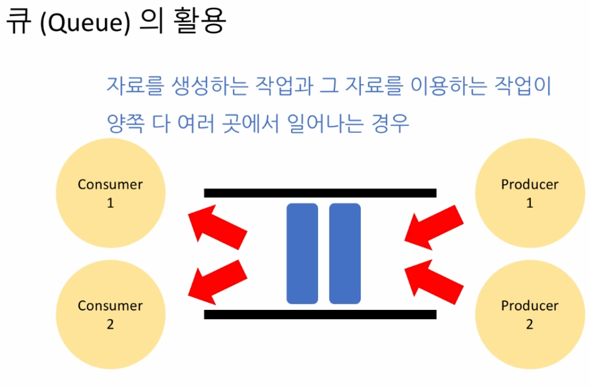
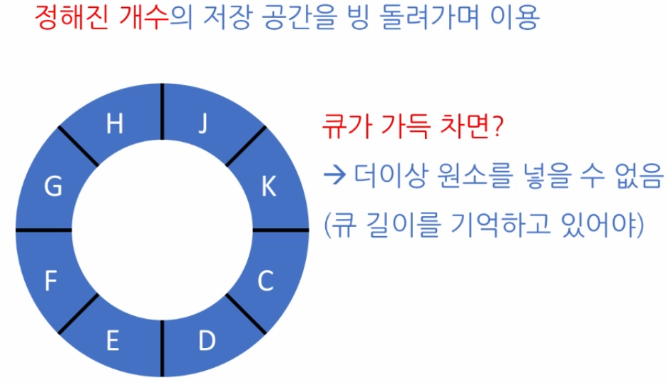

# 큐 (Queues)
- 선입선출(FIFO)의 선형 자료구조
- 데이터를 큐에 넣는것 : 인큐
- 데이터를 큐에서 꺼내는것: 디큐
- 선형배열의 연결리스트에서는 디큐연산이 O(n)의 시간을 소요한다
  - 나머지 원소들을 한칸씩 다 당겨야하기 때문
- 그래서 이중연결리스트를 활용하여 큐를 구현하는것이 연산에 유리하다
- pythonds.basic.queue 의 Queue()를 활용하여 바로 쓸 수 있다  

  


```python
# 이중연결리스트로 큐 구현
class Node:

    def __init__(self, item):
        self.data = item
        self.prev = None
        self.next = None

class DoublyLinkedList:

    def __init__(self):
        self.nodeCount = 0
        self.head = Node(None)
        self.tail = Node(None)
        self.head.prev = None
        self.head.next = self.tail
        self.tail.prev = self.head
        self.tail.next = None

    def getLength(self):
        return self.nodeCount

    def traverse(self):
        result = []
        curr = self.head
        while curr.next.next:
            curr = curr.next
            result.append(curr.data)
        return result

    def reverse(self):
        result = []
        curr = self.tail
        while curr.prev.prev:
            curr = curr.prev
            result.append(curr.data)
        return result

    def getAt(self, pos):
        if pos < 0 or pos > self.nodeCount:
            return None

        if pos > self.nodeCount // 2:
            i = 0
            curr = self.tail
            while i < self.nodeCount - pos + 1:
                curr = curr.prev
                i += 1
        else:
            i = 0
            curr = self.head
            while i < pos:
                curr = curr.next
                i += 1

        return curr

    def insertAfter(self, prev, newNode):
        next = prev.next
        newNode.prev = prev
        newNode.next = next
        prev.next = newNode
        next.prev = newNode
        self.nodeCount += 1
        return True

    def insertAt(self, pos, newNode):
        if pos < 1 or pos > self.nodeCount + 1:
            return False

        prev = self.getAt(pos - 1)
        return self.insertAfter(prev, newNode)

    def popAfter(self, prev):
        curr = prev.next
        next = curr.next
        prev.next = next
        next.prev = prev
        self.nodeCount -= 1
        return curr.data

    def popAt(self, pos):
        if pos < 1 or pos > self.nodeCount:
            raise IndexError('Index out of range')

        prev = self.getAt(pos - 1)
        return self.popAfter(prev)

    def concat(self, L):
        self.tail.prev.next = L.head.next
        L.head.next.prev = self.tail.prev
        self.tail = L.tail

        self.nodeCount += L.nodeCount

class LinkedListQueue:

    def __init__(self):
        self.data = DoublyLinkedList()

    def size(self):
        return self.data.nodeCount

    def isEmpty(self):
        return self.data.nodeCount==0

    def enqueue(self, item):
        node = Node(item)
        self.data.insertAt(self.size()+1,node)

    def dequeue(self):
        return self.data.popAt(1)

    def peek(self):
        return self.data.head.next.data
```
<br>


# 환형 큐
- 길이를 설정하고 길이 내에서 순환하여 계속 사용 가능한 큐
- 큐가 꽉 차기전에 큐를한칸비우고 또채우고 식의 반복  
  

```python
class CircularQueue:
    # 빈 큐를 초기화 (주어진 인자로 큐의 최대) 길이 설정
    def __init__(self, n):
        self.maxCount = n
        self.data = [None] * n
        self.count = 0
        self.front = -1
        self.rear = -1
        
    # 현재 큐 길이를 반환
    def size(self):
        return self.count
    
    # 큐가 비어있는가?
    def isEmpty(self):
        return self.count == 0
    
    # 큐가 꽉 차있는가?
    def isFull(self):
        return self.count == self.maxCount
    

    # 정해진 공간을 빙 돌려가며 이용, 즉 공간을 재활용해야 하기 때문에, 
    # front 와 rear 를 마냥 증가시키기만 함으로써는 환형 큐를 구성할 수 없다. -> 환형은 나머지를 이용
    # 큐에 데이터 원소 추가
    def enqueue(self, x):
        if self.isFull():
            # IndexError('Queue full') exception으로 처리
            raise IndexError('Queue full')
        
        self.rear = (self.rear + 1) % self.maxCount
        self.data[self.rear] = x
        self.count += 1

    # 큐에서 데이터 원소 뽑아내기
    def dequeue(self):
        if self.isEmpty():
            raise IndexError('Queue empty')

        self.front = (self.front + 1) % self.maxCount
        x = self.data[self.front]
        self.count -= 1
        return x

    # 큐의 맨 앞 원소 들여다 보기
    def peek(self):
        if self.isEmpty():
            raise IndexError('Queue empty')
        return self.data[(self.front + 1) % self.maxCount]
```
<br>

# 우선순위 큐 (Priority Queues)
- 큐가 FIFO를 따르지않고 원소의 우선순위에따라 큐에서 빠져나오는 방식
  - cpu에서 시스템별 우선순위부여하여 작업실행  

- Enqueue할때 우선순위를 유지시키기 vs Dequeue할때 우선순위높은것을 선택하기
  - Enequeue할때 유지시켜서 넣는것이 효율적이다
  - 만약 큐가 뒤죽박죽일때 우선순위높은것을 다시 찾아서 dequeue하기위해 전부다 찾아봐야한다  


- 선형배열보다는 연결리스트를 이용하는것이 일반적으로 유리하다
  - 단, 메모리의 크기에따라 선형배열이 더 효과적일 수도 있다


```python
class PriorityQueue:
    # 양방향 연결리스트를 이용하여 빈 큐를 초기화
    def __init__(self, x):
        self.queue = DoublyLinkedList()
    
    # 크기를 반환
    def size(self):
        return self.queue.getLength()

    # 비어있는가?
    def isEmpty(self):
        return self.size() == 0
        
    # 데이터 삽입 연산
    def enqueue(self, x):
        newNode = Node(x)
        
        # 처음 시작하는 위치 head에서 시작
        curr = self.queue.head
        
        # 끝까지 가지 않을 조건 && 우선순위를 비교하는 조건
        while curr.next != self.queue.tail and x < curr.next.data :
            curr = curr.next
        
        # 양방향 연결리스트를 이용해 삽입! 
        self.queue.insertAfter(curr, newNode)
        
        # 양방향 연결리스트의 getAt()메서드를 이용하지 않는다.
        # getAt() 메서드사용시 앞에서부터 pos까지 쭉 이동하기때문에 결국 선형탐색이다
        # 그러므로 while문 내부에서 getAt()메서드를 사용하면 복잡도가 올라간다
        # curr라는 포인터를 활용해서 바로바로 옆칸으로 넘겨줌으로써 복잡도를 줄인다 
    
    # 데이터 삭제 연산
    def dequeue(self):
        return self.queue.popAt(self.queue.getLength())

    # 첫번째 데이터 반환
    def peek(self):
        return self.queue.getAt(self.queue.getLength()).data

```
