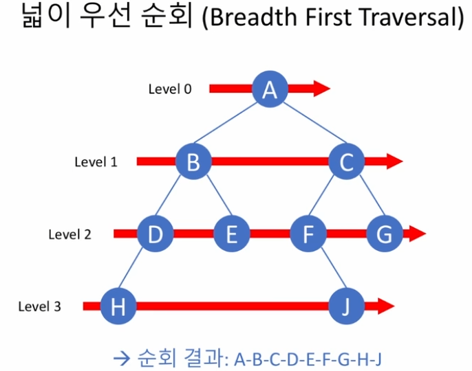

# 트리
- node와 edge로 이루어진 추상적 자료구조 표현
- 순환하지 않는 그래프(Graph)

## 이진 트리 (binary trees)
- 모든 노드의 차수가 2 이하인 트리
- 재귀적으로 정의할수있다
    - 루트 + 왼쪽서브트리 + 오른쪽서브트리(단, 각각의 서브트리도 이진트리)
    - 빈 트리도 이진 트리라고 할 수 있다


## 포화 이진 트리 (full binary trees)
- 모든 레벨에서 노드들이 모두 채워진 이진트리
- 높이가 k 라면, 노드의 개수가 2<sup>k</sup> - 1  
    


## 완전 이진 트리 (complete binary trees)
- 높이 k 인 완전 이진트리
    - 레벨 k-2까지는 모든 노드가 2개의 자식을가진 포화 이진트리
    - 레벨 k-1 에서는 왼쪽부터 노드가 순차적으로 차있는 이진트리
  

# 이진트리의 순회
## 깊이 우선순회(DFS; depth first traversal)
- 중위 순회  
    

- 전위 순회  
    

- 후위 순회  
    

```python
# 깊이우선순회 구현
class Node:

    def __init__(self, item):
        self.data = item
        self.left = None
        self.right = None
    # 중위순회
    def inorder(self):
        traversal = []
        if self.left:
            traversal += self.left.inorder()
        traversal.append(self.data)
        if self.right:
            traversal += self.right.inorder()
        return traversal

        # 전위순회
    def preorder(self):
        traversal = []
        traversal.append(self.data)
        if self.left:
            traversal += self.left.preorder()
        if self.right:
            traversal += self.right.preorder()
        return traversal

    # 후위순회
    def postorder(self):
        traversal = []
        if self.left:
            traversal += self.left.postorder()
        if self.right:
            traversal += self.right.postorder()
        traversal.append(self.data)
        return traversal

class BinaryTree:

    def __init__(self, r):
        self.root = r

    def inorder(self):
        if self.root:
            return self.root.inorder()
        else:
            return []
        
    def preorder(self):
        if self.root:
            return self.root.preorder()
        else:
            return []
        
    def postorder(self):
        if self.root:
            return self.root.postorder()
        else:
            return []
```


## 넓이 우선 순회 (BFS; Breadth First Traversal)
- 수준(level)이 낮은 노드를 우선방문
- 노드의 수준이 같다면
  - 부모노드 방문순서에따라 방문
  - 왼쪽 자식노드를 오른쪽 자식보다 먼저방문
- 재귀적인 방법 대신 큐 이용  
  


- DFS 구현 슈도코드
  - (초기화)traversal , queue 선언
  - 빈 트리가 아니면, root node를 queue에 추가(enqueue)
  - queue가 비어있지않은동안
    - queue에서 원소 추출(dequeue)하여 node에 담는다
    - 노드방문
    - node의 왼쪼그, 오른쪽 자식이 있으면 이것들을 queue에 추가
  - queue가 비면 모든 노드 방문완료
```python
# 큐를 이용하여 DFS구현
class ArrayQueue:

    def __init__(self):
        self.data = []

    def size(self):
        return len(self.data)

    def isEmpty(self):
        return self.size() == 0

    def enqueue(self, item):
        self.data.append(item)

    def dequeue(self):
        return self.data.pop(0)

    def peek(self):
        return self.data[0]


class Node:

    def __init__(self, item):
        self.data = item
        self.left = None
        self.right = None


class BinaryTree:

    def __init__(self, r):
        self.root = r

    def bft(self):
        traversal = []
        q = ArrayQueue()

        if self.root:
            q.enqueue(self.root)

        while not q.isEmpty():
            node = q.dequeue()
            traversal.append(node.data)

            if node.left:
                q.enqueue(node.left)
            if node.right:
                q.enqueue(node.right)

        return traversal
```


