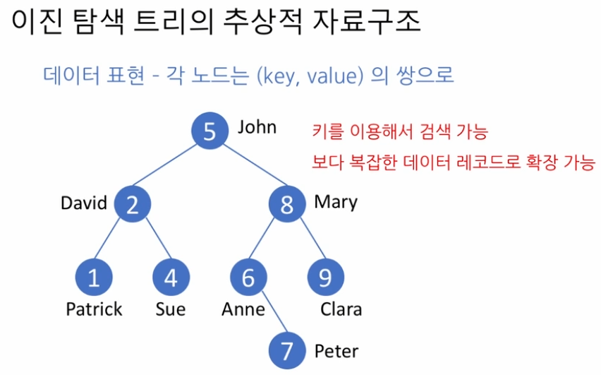

# 이진 탐색 트리 (Binary Search Trees)
- 이진트리의 일종으로 이진탐색 알고리즘을 사용한다
- 단 이진탐색을 사용하기위해서는 탐색대상이 정렬되어있어야 한다
    - 데이터에 값을 추가하거나 삭제하는일은 O(n)의 복잡도를 가진다
- 모든 노드에대해 왼쪽 서브트리의 값(키)은 현재노드보다 작고 오른쪽 서브트리는 현재노드보다 크다
- 핵심개념은 재귀와 탐색(lookup)이다  
    

