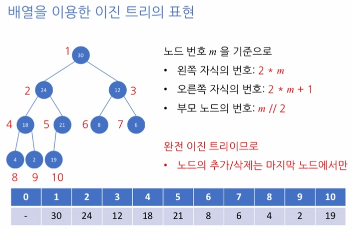

# 힙 (Heaps)
- 이진트리의 한 종류(이진 힙-binary heap)
- 루트노드가 언제나 최댓값 or 최솟값을 가진다
  - 최대힙, 최소힙
- 원소들은 크기순으로 정렬되어있지않다
- 특정 키값을가진 노드를 빠르게 검색할 수 없다
- 완전이진트리여야한다  
<br>

## Heap 형태  
  
<br><br>

## MaxHeap 원소 삽입
1. 트리의 마지막 자리에 새로운 원소를 임시저장
2. 부모노드와 키값을 비교하여 위로이동(반복)
- 원소가 n 개인 최대힙의 원소삽입 -> O(log(n))
<br><br>

## MaxHeap 에서 최대원소 삭제
1. 루트노드의 제거(최대값)
2. 트리의 마지막자리 노드를 임시로 루트노드에 배치
3. 루트노드를 자식노드들과 값을 비교하여 아래로 이동(반복)
   1. 자식이 둘이라면 둘중에 더 큰값과 자리바꿈
- 원소가 n 개인 최대힙의 최대원소삭제 -> O(log(n))  
<br>

## 최대/최소 힙의 응용
- 우선순위 큐
  - Enqueue 할떄 "느슨한 정렬"을 이루도록 함 : O(log(n))
  - Dequeue 할때 최댓값을 순서대로 추출 : O(log(n))
  - 양방향 연결리스트를 이용하여 구현한것보다 시간적인 장점이있다
- 힙 정렬
  - 정렬되지않은 원소들을 아무 순서대로 힙에 삽입: O(log(n))
  - 삽입이 끝나면, 힙이 빌떄까지 하나씩 삭제: O(log(n))
  - 원소들이 삭제된 순서가 원소들의 정렬 순서
  - 정렬 알고리즘의 복잡도 : O(n log(n))

- 파이썬의 heapq 활용
  - 실제 문제풀이에서는 파이썬 heapq모듈의 heapq메서드들을 활용하여 손쉽게 구현
  - 파이썬의 heapq는 최소힙
<br>

```python
# 최대 힙 구현
class MaxHeap:
    def __init__(self):
        self.data = [None]

    def insert(self, item):
        m = len(self.data)
        self.data.append(item)
        
        if m == 1: #빈 리스트일때 0은 None이므로 에러
            return
        
        while self.data[m//2] < self.data[m]: #값이 클때 까지
            self.data[m], self.data[m//2] = self.data[m//2], self.data[m] #치환
            m = m // 2 #상위 레벨로
            if m == 1: #루트노드면 종료
                break

    def remove(self):
        if len(self.data) > 1:
            self.data[1], self.data[-1] = self.data[-1], self.data[1] # 제일끝값을 루트와 자리바꿈
            data = self.data.pop(-1) # 맨뒤로간 루트 pop
            self.maxHeapify(1) # 루트가된 제일끝이였던값을 maxheapify로 다시 힙의구조를 띄도록 자식들과 대소 비교
        else:
            data = None # 빈리스트라면 none 반환
        return data

    # 새로운값이 루트가되었을때 내려가며 비교하는 과정 구현
    def maxHeapify(self, i):
        # 왼쪽 자식 (left child) 인덱스 계산
        left = i * 2

        # 오른쪽 자식 (right child) 인덱스 계산
        right = i * 2 + 1
        
        # 현재 루트값
        smallest = i
        
        # 부모와 왼쪽 -> 오른쪽 순으로 비교하며 결국엔 둘중 큰값과 자리를 바꾼다
        # 왼쪽,오른쪽중 큰값과 자리를바꿔야 바뀐값이 루트가되어도 힙 형태가 유지된다
        
        # 왼쪽 자식이 존재하는지, 그리고 왼쪽 자식의 (키) 값이 (무엇보다?) 더 큰지를 판단
        if left < len(self.data) and self.data[smallest] < self.data[left]:
            # 조건이 만족하는 경우, smallest 는 왼쪽 자식의 인덱스를 가집니다.
            smallest = left

        # 오른쪽 자식이 존재하는지, 그리고 오른쪽 자식의 (키) 값이 (무엇보다?) 더 큰지를 판단
        if right < len(self.data) and self.data[smallest] < self.data[right]:
            # 조건이 만족하는 경우, smallest 는 오른쪽 자식의 인덱스를 가짐
            smallest = right

        if smallest != i:
            # 현재 노드 (인덱스 i) 와 최댓값 노드 (왼쪽 아니면 오른쪽 자식)를 교체
            self.data[i], self.data[smallest] = self.data[smallest], self.data[i]

            # 재귀적 호출을 이용하여 최대 힙의 성질을 만족할 때까지 트리를 정리
            self.maxHeapify(smallest)

# 힙 정렬 구현
def heapSort(unsorted):
    H = MaxHeap()
    for item in unsorted: # 힙에 정렬되지않은 리스트 삽입
        H.insert(item)
    sorted = []
    d = H.remove() # 루트값(최대값)을 뽑고 나머지 요소를 다시 힙으로 만들고 반복
    while d:
        sorted.append(d)
        d = H.remove()
    return sorted # 매번 최대힙에서 최대값을 뽑아서 sorted에 저장했으므로 내림차순정렬이 완성됨
```
